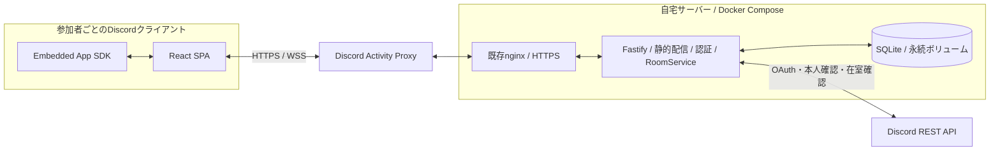
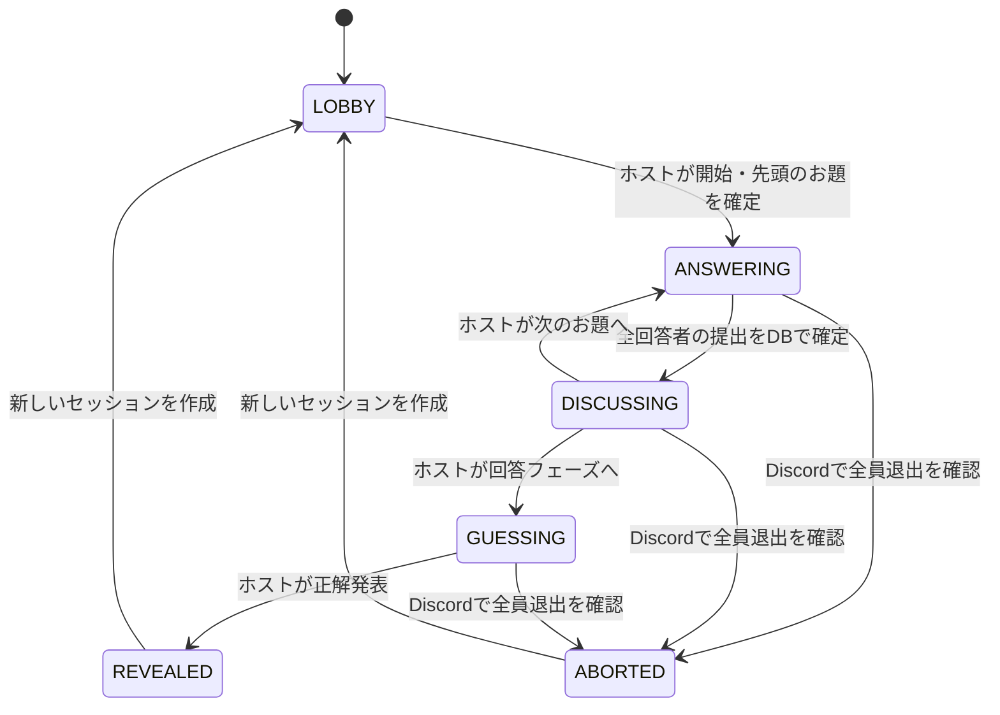

# pittan 実装アーキテクチャ

設計日: 2026-09-12 / 状態: サーバー・PC/Mobile UIを実装し、ローカル検証を実施。Discord実機・自宅サーバー公開は未実施。検証範囲は[実装検証記録](docs/design-docs/005-verification.md)を参照。

## 1. 決定

**React + TypeScript + ViteでFigmaのUIを実装し、Node.js + Fastifyの単一プロセスでゲーム進行を管理する。通信はHTTPSとWebSocket、永続化はSQLite。Linux上のDocker Composeで運用し、既存nginxを入口にする。**

pittanは継続的に座標を同期するゲームではなく、回答提出・公開・予想・結果発表を全員で共有する会話ゲームである。重要なのは描画エンジンの速度より、匿名情報の保護、操作の確定順序、再接続時の復元、Figmaとの視覚的一致である。

| 項目 | 採用 | 理由 |
| --- | --- | --- |
| UI | React / TypeScript / Vite SPA | Figmaの共通部品と画面状態をそのまま構造化できる。検索エンジン向けSSRは不要 |
| スタイル | 共通CSS + CSS変数 | 寸法、字間、余白、輪郭を直接制御。Figmaの値をCSS変数へ対応付け |
| 描画 | HTML / CSS / Figma固有のSVGアセット | テキスト入力・選択・スクロールが中心。Canvasへの描画は不要 |
| アイコン | @tabler/icons-react | 操作・ナビ・役割はOutline、匿名IDは固定対応のFilled。必要な部品だけnamed import |
| 端末対応 | 共通ロジック + PC / Mobileの表示構成 | PCを先に完成させ、追加されたスマホFigmaも同じSPAで再現 |
| D&D | dnd-kitのReactパッケージ | デザインを変更せず、ハンドル操作・キーボード操作・並べ替えを実装 |
| サーバー | Node.js 24 LTS / Fastify / @fastify/websocket | HTTPとWebSocketを一つの常駐プロセスで扱える |
| 検証 | Zod | HTTP/WS境界の入力検証と共有DTOの型を一元化 |
| DB | SQLite / better-sqlite3 / WAL | 自宅の単一サーバーで、短い更新をトランザクションにまとめられる |
| 配布 | 一つのDockerイメージ | Reactの静的成果物とAPIを同じリリースとして配布 |
| 実行 | Docker Compose / 1 app replica | 既存nginxからHTTPポートへ接続。DB用コンテナは不要 |
| 検証環境 | Vitest / Playwright | ゲームルール、複数クライアント、画面の画像比較を分担 |

Node.jsのLTS状態は公式一覧で確認した。依存の正確なバージョンはpackage-lock.json、Node系統は.node-version、ベースイメージはDockerfileへ記録する。[Node.js releases](https://nodejs.org/en/about/previous-releases)

標準のnode:sqliteも比較したが、確認時点のNode.js 24ではStability 1.2のRelease candidateである。初回は同期トランザクションとonline backupのAPIが揃ったbetter-sqlite3を選ぶ。SQLを直接使い、別のORM依存は増やさない。[Node.js 24 SQLite](https://nodejs.org/download/release/latest-v24.x/docs/api/sqlite.html)

dnd-kitは現行のReact用APIを基準とし、旧世代のAPIを混ぜない。外観を伴う既製UIキットは導入せず、必要になった選択ポップオーバーの位置計算・アクセシビリティに限りheadless部品を追加できる。[dnd-kit](https://dndkit.com/react/quickstart/)

## 2. 設計の根拠と範囲

### ユーザーが確定した条件

- Discord Activityとして動く会話ゲーム。
- 回答者と閲覧者を分け、回答者にセッション内で固定されたランダムな匿名IDを割り当てる。
- 全回答者が提出したときに回答を一斉公開する。
- 回答公開後に次のお題へ進むか、正体を予想するフェーズへ進むかをホストが選ぶ。
- 回答者・閲覧者とも正体を予想し、完了人数を表示する。
- お題別・回答者別の履歴と、正解発表後の振り返り。
- ホストによる待機中のお題の削除とD&D並べ替え。
- Figmaを忠実に再現する。PC版を先に完成させる。追加されたスマホ版も今回の設計対象に含める。
- アイコンはTablerから用途に合うものを選ぶ。
- Linux + Docker Composeの自宅サーバー。既存nginxへ接続する。

### 今回確認した成果物

[Figma Screens](https://www.figma.com/design/tVG0kJxe65OymFPLthTqrk?node-id=3-2)をライブ取得した。1280×800の画面が19個、投稿・削除確認のモーダルが2個ある。主要5画面についてdesign contextと画像を確認した。全21参照をブラウザで撮影し、Figma画像と比較した。

追加の[Mobile Screens](https://www.figma.com/design/tVG0kJxe65OymFPLthTqrk?node-id=127-16)には390×844の通常画面20個・シート8個、360×640の確認画面4個がある。入力・予想・履歴・正体選択・投稿の5画面でdesign contextと画像を確認し、主要領域の実寸、Mobile Components、History BrowserのMobile variantsを取得した。下部ナビの20pxはサンプルのセーフエリアであり、端末共通の固定余白ではない。

数値と参照IDは[画面・トークンの取得記録](docs/design/figma-inventory-2026-09-12.json)、[部品・モーダルの取得記録](docs/design/figma-components-2026-09-12.json)に保存した。これは取得時点の記録であり、Figmaが更新された場合は再取得する。

追加分は[スマホ取得記録](docs/design/figma-mobile-inventory-2026-09-12.json)に保存した。PC 21状態 + Mobile 32参照の計53参照を比較対象とする。全53参照の撮影・初回比較を実施。Tabler置換と参照データ差分を[検証記録](docs/design-docs/005-verification.md)へ記載。Discordスマホ実機検証は未実施。

旧handoffの「数字の匿名ID」は採用しない。現在はA〜Jと専用図形。現在のFigmaではHistory Browserがページ10に移っており、過去のページ番号から編集対象を推定しない。

### 設計を補う初期仕様

以下はユーザーが明示していない部分に対する今回の設計判断。実装者が個別に異なる挙動を作らないための初期値である。

| 項目 | 初期仕様 |
| --- | --- |
| 回答者数 | 2〜10人。現在の匿名アイコン10種類に対応。配列・DBは10枠固定にしない。11人以上の受付は追加アイコン・配置の確認後に拡張 |
| 部屋の人数 | 閲覧者を含め同一セッション32人まで。接続数ではなく一意な参加者数で数える。進行中の離脱者の枠も保持 |
| お題 / 回答 | 80文字 / 140文字。Figmaの表示を採用。文字の数え方はプロトコルに定義 |
| お題の上限 | セッションで50件まで。削除後も投稿回数を数え、無制限な投稿・削除を防ぐ |
| ホスト | 最初の認証済み入室者。Discord管理者権限とは独立。回答者にも閲覧者にもなれる |
| ロール | 初回入室は閲覧者。ロビーで変更可。開始時に回答者を固定。途中参加は閲覧者 |
| 予想 | 自分以外を採点。回答者10人なら9問、閲覧者なら10問。1人を重複して割り当てられない |
| 結果発表 | ホストが実行。未完了者がいる場合は確認操作を要求し、未選択を不正解として確定 |
| 再プレイ | ホストがロビーへ戻す。新sessionId・新匿名割当。前回のお題や回答を新ゲームへ自動転記しない |
| 履歴の寿命 | 同じActivityの現在のセッション内。永続的な戦績・部屋をまたぐ検索は初期機能に含めない |
| 保存期間 | 無人になってから24時間で部屋とゲーム内容を削除。再プレイで閉じた旧sessionも24時間で削除。バックアップは暗号化して7日でローテーション |

## 3. 全体構成



Activityの共有単位にはDiscordのinstanceIdを使う。channelIdだけを部屋IDにすると、同じチャンネルで再起動した別Activityと混ざる。内部roomIdはapplicationId + instanceIdから一意に引く。[Discord Multiplayer Experience](https://docs.discord.com/developers/activities/development-guides/multiplayer-experience)

ゲーム進行の正本はDB。メモリには接続一覧、短時間の認証キャッシュ、再送待ちなどの一時情報だけを置く。ブラウザは自分向けに加工された状態を受け取り、そこから画面を描く。

## 4. コードの責務

最初は一つのpackage.jsonと一つのリリース単位を使う。ワークスペースの分割や独立したUIパッケージは不要。

```text
src/
  client/
    main.tsx / App.tsx   起動、画面・モーダル・コマンドの組み立て
    components/         primitives、game、history、feedbackのFigma対応部品
    screens.tsx         共通部品を組み合わせた画面
    connection.ts       SDK、HTTP、WS、ACK、再接続
    hooks.ts            幅・利用可能領域・下書き
    styles.css          tokens、fonts、PC / Mobile配置
    fixtures.ts         開発ビルド専用のFigma参照データ
  shared/
    protocol.ts         DTO / コマンドのZodスキーマ
    text.ts             文字数と改行
  server/
    index.ts / app.ts   起動、ルート、WS、heartbeat、停止
    auth.ts             認証、在室確認、使い捨てticket
    rooms.ts            トランザクション、権限、projection、履歴
    game.ts             匿名割当と採点
    db.ts / backup.ts   SQLite schema、暗号化backup / restore
public/assets/figma/     Figma固有SVG
public/licenses/         フォントとTablerのライセンス
scripts/                開発起動、ローカル負荷・ブラウザ検証
tests/                  ドメイン、DB、TCP WS、HTTP、暗号化バックアップ
docs/                   設計と検証記録
```

- clientからserverをimportしない。sharedにも秘密の匿名対応表・DBモデルを置かない。
- 表示部品はpropsとイベントだけを受け取り、WebSocket・Discord SDK・DBを知らない。
- gameはReact、Fastify、SQLiteをimportしない。時刻と乱数は引数として渡す。
- roomsが権限、現在の状態、重複操作を検査し、gameの結果を同一DBトランザクションで保存する。
- DB行をそのまま返さず、projection関数が公開可能なフィールドを選んでRoomViewを生成する。
- ReactではActivityConnectionのRoomViewをuseSyncExternalStoreで購読し、propsで各画面へ渡す。タブ・モーダル・スクロール・入力中テキストはローカル状態に置く。最初から別の状態管理ライブラリは入れない。
- リアルタイム更新は小さな公開状態のsnapshotで配信し、過去の回答本文は選択した履歴だけHTTPSで読む。詳細は[通信契約](docs/PROTOCOL.md)。

### PCとスマホの分担

一つの接続・RoomView・featureごとの操作処理を共有する。レイアウト切替のために別URL、別room、別API、別のゲーム状態を作らない。ブレークポイントはiframeのCSS幅1024px。1024px以上はPC構成、未満はMobile構成とし、端末名やuser agentで判定しない。これは中間幅を補う設計判断であり、Figmaの基準寸法はPC 1280×800、Mobile 390×844 / 360×640。

通常の配置差はCSSで吸収する。PCの履歴sidebarとMobileの選択シート、PCの予想一覧とMobileの匿名IDタブは表示構成を分け、同じview model・選択ID・操作関数を渡す。PCとMobileの両方の入力DOMを同時に描画して片方を隠す方式は使わない。下書き・予想choices・選択IDはレイアウトより上位に置き、幅が変わっても保持する。

MobileのGUESSINGでは横スクロールのA〜Jから1人を選び、その人の予想欄と回答履歴を表示する。1人を選んでも他の予想は消さず、既存の全choices保存・version競合規則を使う。閲覧用の回答者選択と、予想対象の選択は別のローカル状態にする。

BottomSheetとPC Dialogは同じフォーム・確認処理を共有する。端末をまたいだresizeでは入力を維持して提示形式だけを切り替え、実行前に現在のphase・host・対象IDを再確認する。ブレークポイント切替はサーバーへのコマンドではない。

Tablerの採用名・寸法・Figmaとの差分管理は[画面契約](docs/DESIGN_CONTRACT.md)に定義する。アイコン名をサーバーから送らず、意味と表示の対応はクライアント内で固定する。

## 5. ゲーム状態と画面を分離する

DB上のフェーズは次の6種類。画面番号02、03、04や「タブを開いた」はフェーズではない。



| サーバー状態 | クライアントの表示 |
| --- | --- |
| LOBBY | ロール選択、参加者一覧、ホストの開始ボタン |
| ANSWERING / 回答者 / 未提出 | 折り返しメモの入力欄 |
| ANSWERING / 回答者 / 提出済み | 同じメモ背景で待機、提出取消 |
| ANSWERING / 閲覧者 | 同じメモ背景で待機、取消はなし |
| DISCUSSING | 全員の匿名回答。ホストだけ進行操作 |
| GUESSING | PCは履歴と予想を左右配置。Mobileは匿名IDタブ、選んだ人の予想・履歴、下部の完了操作 |
| REVEALED | 実名との対応と自分の正解数。結果 / 振り返りはローカルな表示切替 |

Figmaの「回答フェーズ」は正体予想を指す。回答本文を書く段階と混同しないよう、コードではGUESSINGとANSWERINGを分ける。

通常のタブ移動で他人の画面は変えない。phaseが変わったときは全員のプレイ表示を更新し、ローカルのタブをプレイへ戻す。結果発表や再プレイ時は古いモーダル・選択状態を閉じる。下書きは別管理なので、通常の履歴閲覧では失われない。

初回のroom作成とLOBBY session作成は同じトランザクションで行う。進行中に全socketがなくなり、Discordでも全員退出を確認すると、旧sessionをABORTEDとして閉じ、新しいLOBBY sessionを同じトランザクションで作る。手動中断コマンドは設けない。ABORTED専用画面で参加者を待たせない。通常の再プレイも旧sessionを閉じて新しいLOBBYへ移る。

### 開始とお題

開始には、接続済み回答者が2人以上、人数が上限以内、待機中のお題が1件以上、実行者が現在のホストであることを要求する。開始時に回答者名簿と匿名対応を固定し、先頭のお題をcurrentにする。

LOBBYの一覧は現在入室中の人を対象とし、開始時にsession_membersへ固定する。開始後の途中参加者は同じsessionへ閲覧者として追加する。再プレイ時はその時点で接続中の人からロビーを作り直す。過去sessionの名簿を現在の人数や候補一覧に混ぜない。

お題投稿はLOBBY / ANSWERING / DISCUSSINGで全参加者に許可する。GUESSING以降は投稿受付を止める。ホストが並べ替え・削除できるのはqueuedだけ。current / published / deletedは操作対象にできない。

各お題のtopicIdは不変。画面に出る01、02は表示順であり、IDではない。待機中の番号はD&Dで変わり、開始時にroundNumberが固定される。履歴のQ1、Q2はこの固定番号を使う。

### 提出と一斉公開

回答者1人・お題1件につき回答は1件。空白だけの回答は拒否する。提出済みの本文は自分にだけ返せるが、他人へは件数だけを返す。対応表、提出者別進捗、提出時刻は配信しない。

最後の提出を保存するトランザクションで、回答数と固定された回答者数が一致したらDISCUSSINGへ変更する。commit後に全員へ公開する。Figmaの5秒待ちのデモ遷移は実装しない。

取消はANSWERING中だけ。最後の提出が先にcommitした場合、後から届く取消はPHASE_CHANGEDになる。取消が先なら未提出者が残るため公開しない。クライアント時刻による順序変更や公開後の巻き戻しは行わない。

### 匿名IDと予想

サーバーの暗号学的乱数を使い、固定した回答者集合をFisher–YatesでシャッフルしてA〜Jへ割り当てる。匿名ID・図形の対応は全員共通、人物との対応はセッションごとに変わる。再接続しても再抽選しない。

自分の匿名IDだけは本人用のprivate情報に含める。GUESSINGでは自分の行を自動設定・編集不可にし、採点から除く。公開回答の本文から推理できること自体はゲームの目的である。

予想の候補は開始時の回答者名簿。異なる匿名IDに同じ人物を選択できない。未選択はnullとして保存できる。「予想を完了する」は自分以外の全枠が埋まっている場合に有効。完了取消で再編集できる。

GUESSINGに入った時点の接続済み参加者を完了人数の分母として固定する。後から入室した閲覧者は履歴閲覧のみで、その回の完了人数・採点に追加しない。切断だけでは分母を変更しない。

ホストの結果発表は全員完了時に通常実行できる。未完了者がいる場合は確認モーダルを経て確定できる。結果確定後は予想を変更できず、他人の予想は結果画面にも送らない。自分の採点結果と正解対応のみを返す。

## 6. 匿名性を守るデータ境界

| データ | 正体発表前 | 発表後 |
| --- | --- | --- |
| 参加者名簿、ロール、ホスト | 全員へ公開 | 全員へ公開 |
| A〜Jと図形の対応 | 全員へ公開 | 全員へ公開 |
| 人物と匿名IDの対応 | サーバーのみ。本人分だけprivate | 全員へ公開 |
| 未公開回答の本文 | サーバーと本人のみ | 該当お題が公開されたものだけ |
| 公開回答 | anonymousId + text | anonymousId + text + 本人表示 |
| 他人の予想 | 常に非公開 | 非公開 |
| 回答の提出件数、予想完了人数 | 集計のみ公開 | 集計のみ公開 |
| 投稿者ID、正確な提出時刻、乱数seed、Discord token | 非公開 | 非公開 |

「ホストだから未公開データを取得できる」という権限は設けない。アプリのホストも同じルールで推理する。一方、自宅サーバーの管理者はDBへアクセスできる。運営者自身からも秘匿する暗号プロトコルは対象外。

公開IDはroom内のmemberIdとanonymousIdを使い、Discord user IDを回答のキー・URL・DOM属性に混ぜない。名簿のソート順は表示名とmemberIdで決め、匿名シャッフルの順番とは無関係にする。

生のRoomAggregateをJSON化してからフィールドを消す方式を禁止する。公開DTO・本人DTOを許可リストで組み立て、DBモデルをクライアントへimportできない依存方向にする。

## 7. 永続データモデル

1ファイルのSQLiteをappプロセスだけが更新する。SQLはprepared statementを使い、schema_migrationsで連番管理する。初期は汎用RepositoryやORMを挟まない。

| テーブル | 主な列・制約 |
| --- | --- |
| rooms | room_id PK、application_id、instance_id、current_session_id、host_member_id、host_epoch、revision、empty_since、UNIQUE(application_id, instance_id) |
| room_members | room_id、member_id、discord_user_id、display_name、username、avatar情報、lobby_role、version、joined_at、UNIQUE(room_id, discord_user_id) |
| sessions | session_id PK、room_id、phase、current_topic_id、phase_version、queue_version、history_version、started_at、revealed_at、retired_at、policy_json |
| session_members | session_id、member_id、role、anonymous_id nullable、表示名snapshot、guess_eligible、UNIQUE(session_id, member_id)、UNIQUE(session_id, anonymous_id) |
| topics | topic_id PK、session_id、author_member_id、text、status、queue_position、round_number nullable、version、UNIQUE(session_id, round_number) |
| answers | topic_id、session_id、member_id、text、submitted、version、UNIQUE(topic_id, member_id) |
| predictions | session_id、guesser_member_id、anonymous_id、target_member_id nullable、UNIQUE(session_id, guesser_member_id, anonymous_id)、対象人物の重複禁止 |
| prediction_status | session_id、member_id、completed、version、completed_at、score nullable、score_total nullable |
| command_receipts | room_id、session_id、member_id、command_id、request_hash、result_code、applied_revision、UNIQUE(room_id, session_id, member_id, command_id) |
| auth_sessions | token_hash PK、discord_user_id、expires_at、revoked_at。token平文は保存しない |
| schema_migrations | version PK、applied_at |

topic、answer、predictionの参照は同じsessionに属することを複合外部キーとサーバー検証で強制する。SQLiteのforeign_keysを有効にする。回答者以外の回答・候補以外への予想もドメイン検証で拒否する。

同時刻のコマンドも、同期的な短いDBトランザクションとして順番に処理する。処理単位は「最新状態を読む→重複・権限・versionを検査→更新→自動遷移→revisionとreceiptを書き込む」。この中にawaitやDiscord API呼び出しを入れない。失敗時は全体をrollbackし、成功commit後にだけACKとsnapshotを送る。[better-sqlite3 transaction](https://github.com/WiseLibs/better-sqlite3/blob/master/docs/api.md#transactionfunction---function)

SQLiteはWAL + synchronous=FULL、保存先はサーバーのローカルディスクとする。ネットワーク共有上にWAL DBを置かない。単一プロセスを前提とし、ComposeのscaleやNode clusterでプロセスを増やしてはいけない。[SQLite WAL](https://www.sqlite.org/wal.html)

## 8. 切断・再起動・停止

### 接続と再接続

同じDiscordユーザーの複数接続は1人として扱い、同じロール・回答・予想を共有する。どれか1接続が生きていればオンライン。操作の競合は本人データのversionで検出する。

pingを20秒間隔で送り、45秒応答がない接続を切断と判定する。Discord Proxyを通した実機でping/pongの通過とタイムアウトを確認する。クライアントは0.5秒から指数的に待ち時間を増やし、最大10秒、jitter付きで再接続する。

再接続時は本人・部屋を再確認し、現在のsnapshotを取得する。届かなかったイベントを順番に再生する必要はない。ACKを失った操作は同じcommandIdで再送し、既存receiptから結果を返す。

スマホのバックグラウンド化・画面ロックではJSやWSが停止し得るため、ブラウザのtimerをゲーム進行に使わない。前景復帰時は接続を確認してsnapshotを再取得し、確定状態が揃うまで変更操作を待機させる。再認証が必要でも同じinstanceへ戻す。OSがWebViewを破棄した場合、未送信下書きの復元はsessionStorageが残っている範囲に限る。提出済みデータはサーバーから復元する。

### ホストが離れた場合

最後の接続が失われてから60秒はホストを保持する。復帰しなければ、接続中の参加者から入室順で次のホストを選び、host_epochを増加させる。誰もいなければ選ばず、再入室時に確定する。旧ホストが戻っても自動で権限を奪い返さない。

ゲーム名簿から回答者を自動削除しない。削除によって「抜けた実名」と「消えた匿名カード」が結び付くのを防ぐ。回答者が戻らない間は待機する。ユーザー指定により中断操作は置かず、全員がActivityを退出したと確認できた場合だけ自動中断する。通信切断だけでは中断しない。未公開回答を勝手に公開・空回答で補完する処理は設けない。

### サーバー再起動

DBから現在のsession・匿名割当・回答・予想を復元し、全接続を再認証する。起動後60秒はホスト再選出を待つ。期限管理にはDBの時刻を使い、setTimeoutだけを正本にしない。

SIGTERMでは新規入室を止め、進行中の短い処理を完了してDBを閉じる。WebSocketを再接続可能な理由で閉じ、Composeの停止猶予は30秒を確保する。commit済み・未配信の更新は再接続snapshotに含まれる。

プロセス再起動と停電時はローカルDBが正本になるが、ディスク喪失はバックアップ時点へ戻る。初期目標はRPO 1時間、RTO 1時間。実機の復旧試験を行うまで保証値として扱わない。

## 9. Discordとの接続

SDKの役割はDiscord内の起動・認可・クライアント連携。ゲームの回答同期はpittanのサーバーで行う。音声通話はDiscord側を使い、音声サーバーは実装しない。

認証はSDKのauthorizeで取得したcodeを自宅サーバーが交換し、Discord APIで本人を確認する。SDKのauthenticateに必要なユーザーaccess tokenだけをメモリでクライアントへ渡し、client secretとBot tokenは渡さない。アプリ独自の短命認証を続けて発行する。[Discord Activity authentication](https://docs.discord.com/developers/activities/building-an-activity)

入室時はサーバーがBot tokenでActivity Instance APIを呼び、application_id、instance_id、usersを確認する。クライアント申告のuserId・channelId・ホストフラグは権限判定に使わない。APIのusersに本人がいなければ入室を許可しない。[Activity Instance API](https://docs.discord.com/developers/resources/application#get-application-activity-instance)

全クライアント通信は同じActivity Proxy originを経由する。Developer PortalのURL Mappingでルートを自宅サーバーのHTTPS公開先へ向け、/apiと/wsも同じ経路にする。アセット・フォントは自前配信する。第三者cookieに依存しない認証方式を選ぶ。[Discord Networking](https://docs.discord.com/developers/activities/development-guides/networking)

通信エンドポイント・token寿命・在室の再確認・失敗時の扱いは[通信契約](docs/PROTOCOL.md)にまとめた。

スマホではSDKの`--discord-safe-area-inset-*`を優先し、未提供時はCSSの`env(safe-area-inset-*)`へfallbackする。下部ナビ・シートと入力時の利用可能な高さを調整する。iOS / Androidは開発用Applicationで検証し、本番の対応プラットフォームは各実機の受入完了後に有効にする。[Discord Mobile](https://docs.discord.com/developers/activities/development-guides/mobile)

縦向きのFigmaを基準に、狭いPCウィンドウにも幅で対応する。PIP / grid専用の案内UIはFigmaに未定義のため追加しない。前景復帰時は同じ接続手順で最新snapshotを取得する。専用の縮小レイアウトが必要になった場合はFigmaへ先に提案する。[Discord Layout](https://docs.discord.com/developers/activities/development-guides/layout)

## 10. 自宅サーバーでの運用

- appコンテナに静的ファイルとAPIを同梱し、3000/tcpをnginxからだけ到達可能にする。nginxがホスト上なら127.0.0.1へのbind、Docker上なら既存の内部ネットワークを使う。
- /dataと/backupsを永続volumeへ割り当てる。実行ユーザーは非root。capabilitiesを落とし、no-new-privilegesを指定する。
- DISCORD_CLIENT_ID、DISCORD_CLIENT_SECRET、DISCORD_BOT_TOKEN、ALLOWED_ACTIVITY_ORIGIN、DATABASE_PATHをサーバー設定で与える。ブラウザへ埋め込めるのはclient IDだけ。
- imageはビルド済みの固定tag/digestで配布。better-sqlite3のnative addonはLinux向けイメージ内で作成し、macOSのnode_modulesをコピーしない。
- restart: unless-stoppedを使う。/health/liveはプロセス、/health/readyはDB・マイグレーション完了を確認する。Discordの一時的なAPI障害だけで再起動ループを作らない。
- nginxには/wsのUpgrade、Connectionヘッダー転送とheartbeatより長いtimeoutが必要。既存nginx自体の再設計は行わない。[nginx WebSocket proxying](https://nginx.org/en/docs/http/websocket.html)
- 公開時は公開DNS、HTTPS証明書、Discord URL Mapping、対象プラットフォームでの起動可否を実機で確認する。現時点でドメイン・ルーター設定・サーバー性能は未確認。

### バックアップと更新

SQLiteのonline backup APIで整合したコピーを生成し、バックアップを暗号化して/backupsへ保存する。バックアップCLIを実装済み。自宅サーバー側で毎時実行し、別媒体への転送を運用設定する。稼働中のDBファイルだけをcpする手順は使わない。7日で世代を削除する。[SQLite Backup API](https://www.sqlite.org/backup.html)

更新前には即時バックアップを取り、停止→マイグレーション→新image起動→readiness→Discord実機接続の順で切り替える。初期は短時間停止を許容し、DBを書き込む旧新コンテナを同時に動かさない。通常は後方互換のスキーマ追加とし、破壊的変更は復旧手順を別に用意する。

初期実装はhealthチェックと起動・停止ログ、負荷試験スクリプトを持つ。常時メトリクス基盤は未導入。回答本文・予想・token・匿名対応をログへ出さない。ディスク残量、API障害、バックアップ成否の監視は自宅サーバーの運用へ接続する。

## 11. 性能の設計目標と拡張条件

以下は実測ではなく、初回の負荷試験の合格目標。

| 対象 | 目標 |
| --- | --- |
| 同時利用 | 10部屋×32人。各部屋10回答者、50お題で試験 |
| 受信からDB commit | p95 50ms以内 |
| 同地域のPC間で画面反映 | p95 500ms以内。Discord Proxyを含め実機計測 |
| 復旧 | ネットワーク復帰後10秒以内に同じ状態を再表示 |
| 配信の正確さ | 重複提出・権限違反・未公開情報漏出が0件 |
| 通常snapshot | 通常fixtureで64KiB以内を目標。特殊文字を含む絶対上限512KiB。履歴本文は別取得 |

同期SQLite処理がevent loopを長く止める、または1台の障害を許容できなくなった時点でPostgreSQLと部屋単位の処理所有権へ移行する。単にプロセスを増やすだけでは接続一覧と公開順序が分裂する。移行時はルーム所有権、配信経路、重複排除を同時に設計し直す。

初期にはRedis、メッセージブローカー、イベントソーシング、マイクロサービス、SSR、Kubernetesを採用しない。room/sessionの境界と通信契約は保持するため、必要になった箇所から置き換えられる。

## 12. 実装へ渡す文書

- [Figma再現・画面契約](docs/DESIGN_CONTRACT.md): PC・Mobileの計53参照、レスポンシブ構成、Tabler、CSS、フォント、比較方法。
- [通信・コマンド契約](docs/PROTOCOL.md): 認証、DTO、権限、競合、履歴取得。
- [実装順序と受入条件](docs/IMPLEMENTATION_PLAN.md): 各段階の完了条件と、異常系・実機検証。

承認されたFigma補助UIを実装した。P06 / P10 / P11は不採用。設計の更新理由と検証結果はdesign-docsに残す。ドメイン、実機性能、Discord内での受入は公開前に確認する。
